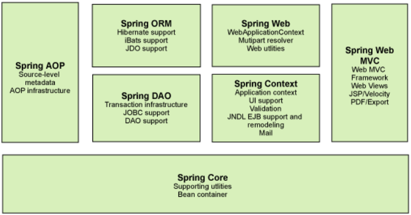
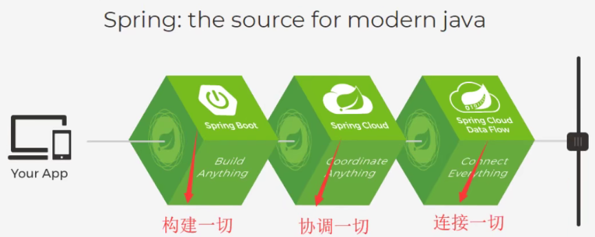
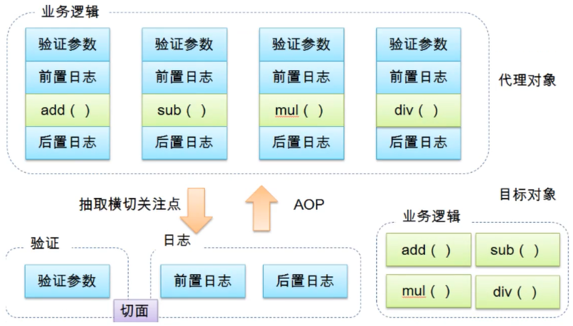

# 一、Spring介绍

spring官网：https://spring.io/

spring下载地址：https://repo.spring.io/ui/native/release/org/springframework/spring

springGitHub地址：https://github.com/spring-projects/spring-framework

2002年，首次推出Spring框架的雏形：interface21框架

Spring框架以interface21框架为基础，于2004年4月23日发布1.0正式版。

Rod Johhson Spring Framework创始人；

Spring的理念：使现有的技术更加容易使用；spring本身就是一个大杂烩，整合了现有的技术框架。

spring-maven

```xml
<!-- spring-webmvc -->
<dependency>
    <groupId>org.springframework</groupId>
    <artifactId>spring-webmvc</artifactId>
    <version>5.2.9.RELEASE</version>
</dependency>
<!-- spring-jdbc -->
<dependency>
    <groupId>org.springframework</groupId>
    <artifactId>spring-jdbc</artifactId>
    <version>5.2.9.RELEASE</version>
</dependency>
```

**优点**

开源的、免费的框架/容器；

轻量级、非入侵式的框架；

**控制反转（IOC）面向切面编程（AOP）**

支持事务的处理，对框架整合的支持

总结：**Spring就是一个轻量级的控制反转（IOC）面向切面编程（AOP）的框架**

# 二、Spring的组成



**扩展**：现代化的Java开发就式基于Spring的开发



**Spring Boot**:一个快速开发的脚手架；基于SpringBoot可以快速开发单个微服务；**约定大于配置**

**Spring Cloud**：基于SpringBoot实现

**Spring的弊端：配置十分繁琐，“配置地狱”**

# 三、IOC理论及本质

**IOC**

转变控制权；这种思想从本质上解决了程序员去管理对象的创建，系统的耦合性大大降低。

**本质**

**控制反转loC(Inversion of Control),是一种设计思想，DI(依赖注入)是实现IoC的一种方法**，也有人认为DI只是
IoC的另一种说法。 没有IoC的程序中,我们使用面向对象编程,对象的创建与对象间的依赖关系完全硬编码在程序
中，对象的创建由程序自己控制，控制反转后将对象的创建转移给第三方，个人认为所谓控制反转就是:获得依赖
对象的方式反转了。

采用XML方式配置Bean的时候，Bean的定义信息是和实现分离的，而采用注解的方式可以把两者合为一体,
Bean的定义信息直接以注解的形式定义在实现类中，从而达到了零配置的目的。

**控制反转是一种通过描述(XML或注解)并通过第三方去生产或获取特定对象的方式。在Spring中实现控制反转的是IoC容器，其实现方法是依赖注入(Dependency Injection,DI)。**

**控制**：传统应用程序的对象是由程序本身控制创建的，在Spring中，对象是由Spring来创建
**反转**：程序本身不创建对象,而变成被动的接收对象. 
**依赖注入**：就是利用set方法来进行注入的。
**IOC是一种编程思想，由主动的编程变成被动的接收**

# 四、HelloSpring

**所谓的IOC就是对象由spring创建、管理、装配。**

创建applicationContext.xml；并把需要托管的对象注册到bean中

```xml
<?xml version="1.0" encoding="UTF-8"?>
<beans xmlns="http://www.springframework.org/schema/beans"
       xmlns:xsi="http://www.w3.org/2001/XMLSchema-instance"
       xsi:schemaLocation="http://www.springframework.org/schema/beans
        https://www.springframework.org/schema/beans/spring-beans.xsd">
    <bean id="mysql" class="com.fivan.mapper.UserMapperMysqlImpl"/>
    <bean id="mr" class="com.fivan.mapper.UserMapperImpl"/>
    <bean id="sqlserver" class="com.fivan.mapper.UserMapperSqlServerImpl"/>
    <bean id="serviceImpl" class="com.fivan.serivce.UserServiceImpl">
        <property name="userMapper" ref="sqlserver"/>
    </bean>
</beans>
```

使用时只需要applicationConext调用getBean创建对象即可。

```java
ApplicationContext context = new ClassPathXmlApplicationContext("beans.xml");
UserServiceImpl serviceImpl = (UserServiceImpl) context.getBean("serviceImpl");
serviceImpl.getUserInfo();
```

# 五、IOC创建对象方式

一、通过无参构造创建对象

```xml
<bean id="person" class="com.fivan.pojo.Person">
    <property name="name" value="people"/>
</bean>
```

二、有参构造创建
1、下标

```xml
<bean id="person" class="com.fivan.pojo.Person">
    <constructor-arg index="0" value="小红index"/>
</bean>
```

2、属性类型

```xml
<bean id="person" class="com.fivan.pojo.Person">
    <constructor-arg type="java.lang.String" value="小红type"/>
</bean>
```

3、属性名

```xml
<bean id="person" class="com.fivan.pojo.Person">
    <constructor-arg name="name" value="小红name"/>
</bean>
```

**当配置文件加载时，在IOC容器中注册的对象都会被初始化！**

# 六、Spring配置

## alias

spring中的alias配置跟mybatis的alias配置相似，都是起别名

```xml
<alias name="person" alias="person"/>
```

## bean

```xml
<!-- id是bean的唯一标识;相当于变量名
    class是对应bean的全限定名（包名+类型）
    name也是别名，而且可以同时取多个，可以用逗号 空格 分号隔开 -->
<bean id="person" class="com.fivan.pojo.Person" name="pson">
    <constructor-arg name="name" value="小红name"/>
</bean>
```

## import

import为导入配置文件，将多个配置文件合并为一个，使用总的配置文件即可（适合团队开发）

```xml
<import resource="beans.xml"/>
<import resource="beans1.xml"/>
```

# 七、DI依赖注入

## 构造器注入

默认的bean创建对象就是构造器注入

## Set注入

依赖注入：set注入
依赖：bean对象的创建依赖于容器
注入：bean对象的属性由容器注入

复杂类型的注入方式：

```xml
<bean id="address" class="com.fivan.pojo.Address">
    <property name="address" value="深圳"/>
</bean>
<bean id="stu" class="com.fivan.pojo.Student">
    <!--普通类型的注入-->
    <property name="name" value="伊凡f"/>
    <!--引用类型注入-->
    <property name="address" ref="address"/>
    <!--数组-->
    <property name="books">
        <array>
            <value>Java基础</value>
            <value>Java面向对象</value>
            <value>Java高级</value>
            <value>MyBatis</value>
        </array>
    </property>
    <!--List-->
    <property name="hobbys">
        <list>
            <value>睡觉</value>
            <value>敲代码</value>
            <value>造bug</value>
        </list>
    </property>
    <!--Map-->
    <property name="card">
        <map>
            <entry key="身份证" value="01010110011010111011110"/>
            <entry key="银行卡" value="10001000101101010111011"/>
        </map>
    </property>
    <!--Set-->
    <property name="games">
        <set>
            <value>sgs</value>
            <value>nba2kol</value>
            <value>sgzj</value>
        </set>
    </property>
    <!--null-->
    <property name="wife">
        <null/>
    </property>
    <!--properties-->
    <property name="info">
        <props>
            <prop key="code">fIvan</prop>
            <prop key="money">8500</prop>
        </props>
    </property>
</bean>
```

## c命名空间和p命名空间注入

```xml
<bean id="user" class="com.fivan.pojo.User" p:age="19" p:name="伊凡f"/>
<bean id="user2" class="com.fivan.pojo.User" c:age="21" c:name="伊凡-f"/>
<!--使用时需要先添加依赖-->
xmlns:p="http://www.springframework.org/schema/p"
xmlns:c="http://www.springframework.org/schema/c"
```

```java
//在getBean中添加对应的反射对象可以避免强制类型转换
User user = context.getBean("user2", User.class);
```

# 八、Bean的作用域

**singleton：单例模式** spring默认机制

```xml
<bean id="student" class="com.fivan.pojo.Student" scope="singleton"/>
```

**prototype：原型模式** 每次从容器中get的时候都会产生一个新的对象

```xml
<bean id="student" class="com.fivan.pojo.Student" scope="prototype"/>
```

**request、session、application都是在web中使用的**

# 九、自动装配

Spring中三种装配方式：xml中显示的配置；Java中显示的配置；**隐式的自动装配bean**

隐式的自动装配bean：

## byName

```xml
<bean id="dog" class="com.fivan.pojo.Dog"/>
<bean id="cat" class="com.fivan.pojo.Cat"/>
<bean id="people" class="com.fivan.pojo.People" autowire="byName">
    <property name="name" value="伊凡f"/>
</bean>
```

byName：需要保证所有bean的id唯一，且需要和自动注入的属性的set方法的值一致。

## byType

```xml
<bean class="com.fivan.pojo.Dog"/>
<bean class="com.fivan.pojo.Cat"/>
<bean id="people" class="com.fivan.pojo.People" autowire="byType">
    <property name="name" value="伊凡f"/>
</bean>
```

byType：需要保证所有bean的class唯一，且需要和自动注入的属性的类型一致。

# 十、注解实现自动装配

使用注解自动装配，先添加依赖，再开启注解支持

```xml
<?xml version="1.0" encoding="UTF-8"?>
<beans xmlns="http://www.springframework.org/schema/beans"
       xmlns:xsi="http://www.w3.org/2001/XMLSchema-instance"
       xmlns:context="http://www.springframework.org/schema/context"
       xsi:schemaLocation="http://www.springframework.org/schema/beans
        https://www.springframework.org/schema/beans/spring-beans.xsd
        http://www.springframework.org/schema/context
        https://www.springframework.org/schema/context/spring-context.xsd">
    <!--开启注解支持-->
    <context:annotation-config />
</beans>
```

**@Autowired**
在属性上使用，也可用在Set方法上；
使用类@Autowired后可以不用set方法，前提是这个属性在IOC容器中存在，且符合byName

```java
public class People {
    @Autowired
    private Dog dog;
    @Autowired
    private Cat cat;
    private String name;
}
```

@Nullable：表示该属性可为null

**@Qualifier(value = "xxx")**
当使用@Autowired隐式自动装配时有多个同类型的bean，就可以用@Qualifier(value = "xxx")结合使用指定bean

```xml
<bean id="cat1" class="com.fivan.pojo.Cat"/>
<bean id="cat2" class="com.fivan.pojo.Cat"/>
```

```java
@Autowired
@Qualifier(value = "cat1")
private Cat cat;
```

**@Resource**

```java
public class People {
    @Resource
    private Dog dog;
    @Resource
    private Cat cat;
    private String name;
}
```

**@Autowired 和 @Resource的区别**

- 都是实现自动装配，都可以放在属性字段上
- @Autowired 通过byType实现，且必须要求对象存在
- @Resource 默认通过byName实现，如果找不到对应的name，则通过byType实现

# 十一、Spring注解开发

```xml
<!--开启注解的支持-->
<context:annotation-config />
<!--包扫描-->
<context:component-scan base-package="com.fivan"/>
```

**@Component**：组件；用在类上，代表被Spring托管
@value：给属性注入值；@Scope("prototype")：设置作用域

```java
@Component
@Scope("prototype")
public class User {
    @Value("伊凡")
    public String name;
}
```

@Repository【dao层】@Controller【controller层】@Service【service层】

xml配置文件与注解的最佳实践：xml负责管理Bean；注解只负责完成属性的注入。

# 十二、JavaConfig配置

```java
//配置文件类
@Configuration
@ComponentScan("com.fivan.pojo")
public class FIvanConfig {
    @Bean //注册一个bean，相当于xml配置文件中的bean标签，方法名相当于id属性，返回值相当于class属性
    public User user(){
        return new User();
    }
}
//测试类
ApplicationContext context = new AnnotationConfigApplicationContext(FIvanConfig.class);
User user = context.getBean("user", User.class);
```

# 十三、静态代理模式

角色分析：
抽象角色：一般为接口或抽象类【出租房子】
真实角色：被代理的角色【房东】
代理角色：代理真实的角色【中介】
客户：要租房子的人

代理模式的好处：可以使真实角色的操作更加纯粹，不用关注一些公共的业务；公共的业务交给代理角色，实现业务的分工；方便对公共业务扩展的管理。
缺点：一个真实角色就会产生一个代理角色；代码量翻倍。

静态代理实现步骤：接口--》真实角色--》代理角色--》客户端访问

抽象角色

```xml
public interface MapperService {
    void add();
    void delete();
    void update();
    void select();
}
```

真实角色

```java
public class MapperServiceImpl implements MapperService{
    @Override
    public void add() {
        System.out.println("新增方法");
    }
    @Override
    public void delete() {
        System.out.println("删除方法");
    }
    @Override
    public void update() {
        System.out.println("修改方法");
    }
    @Override
    public void select() {
        System.out.println("查询方法");
    }
}
```

代理角色

```java
public class MapperServiceProxy implements MapperService{
    private MapperServiceImpl service;
    public void setService(MapperServiceImpl service) {
        this.service = service;
    }
    @Override
    public void add() {
        log("add");
        service.add();
    }
    @Override
    public void delete() {
        log("delete");
        service.delete();
    }
    @Override
    public void update() {
        log("update");
        service.update();
    }
    @Override
    public void select() {
        log("select");
        service.select();
    }
    public void log(String msg){
        System.out.println("[Debug] 执行"+msg+"方法");
    }
}
```

客户端访问

```java
public class Client {
    public static void main(String[] args) {
        MapperServiceProxy proxy = new MapperServiceProxy();
        proxy.setService(new MapperServiceImpl());
        proxy.add();
    }
}
```

# 十四、动态代理模式

动态代理

```java
public class ProxyInvocationHandler implements InvocationHandler {
    //被代理的接口
    private Object obj;
    public void setObj(Object obj) {
        this.obj = obj;
    }
    //生成代理类
    public Object getObj(){
        return Proxy.newProxyInstance(this.getClass().getClassLoader(), obj.getClass().getInterfaces(),this);
    }
    @Override
    public Object invoke(Object proxy, Method method, Object[] args) throws Throwable {
        return method.invoke(obj, args);
    }
}
```

```java
public class Client {
    public static void main(String[] args) {
        MapperServiceImpl service = new MapperServiceImpl();
        ProxyInvocationHandler pih = new ProxyInvocationHandler();
        pih.setObj(service);
        MapperService obj = (MapperService) pih.getObj();
        obj.add();
    }
}
```

# 十五、AOP

AOP (Aspect Oriented Programming)意为：面向切面编程,通过预编译方式和运行期动态代理实现程序功能的
统一维护的一种技术。AOP是OOP的延续，是软件开发中的一个热点，也是Spring框架中的一个重要内容，是
函数式编程的一种衍生范型。利用AOP可以对业务逻辑的各个部分进行隔离，从而使得业务逻辑各部分之间的
耦合度降低，提高程序的可重用性，同时提高了开发的效率。



AOP在spring的作用：
提供声明式事务;允许用户自定义切面
横切关注点：跨越应用程序多个模块的方法或功能。即是，与我们业务逻辑无关的，但是我们需要关注的部分,
	就是横切关注点。如日志，安全,缓存,事务等等....
切面(ASPECT)：横切关注点被模块化的特殊对象。即它是一个类。
通知(Advice) ：切面必须要完成的工作。即，它是类中的-一个方法。
目标(Target) ：被通知对象。
代理(Proxy) ：向目标对象应用通知之后创建的对象。
切入点(PointCut)：切面通知执行的“地点”的定义。
连接点(JointPoint)：与切入点匹配的执行点。

使用aop得先添加依赖

```xml
<!-- https://mvnrepository.com/artifact/org.aspectj/aspectjweaver -->
<dependency>
    <groupId>org.aspectj</groupId>
    <artifactId>aspectjweaver</artifactId>
    <version>1.9.6</version>
</dependency>
```

aop配置

```xml
<!--方式一-->
<aop:config>
    <!--pointcut:切入点，expression：表达式-->
    <aop:pointcut id="pointcut" expression="execution(* com.fivan.serviceaop.UserServiceImpl.*(..))"/>
    <!--advisor：环绕通知-->
    <aop:advisor advice-ref="log" pointcut-ref="pointcut"/>
    <aop:advisor advice-ref="logAfter" pointcut-ref="pointcut"/>
</aop:config>
<!--方式二 自定义切面-->
<aop:config>
    <aop:aspect id="diyPoint" ref="diyPointcut">
        <aop:pointcut id="pointcut" expression="execution(* com.fivan.serviceaop.UserServiceImpl.*(..))"/>
        <aop:before method="before" pointcut-ref="pointcut"/>
        <aop:after-returning method="after" pointcut-ref="pointcut"/>
    </aop:aspect>
</aop:config>
```

## 注解实现AOP

# 十六、整合MyBatis

spring-config.xml

```xml
<?xml version="1.0" encoding="UTF-8"?>
<beans xmlns="http://www.springframework.org/schema/beans"
       xmlns:xsi="http://www.w3.org/2001/XMLSchema-instance"
       xmlns:aop="http://www.springframework.org/schema/aop"
       xmlns:context="http://www.springframework.org/schema/context"
       xsi:schemaLocation="http://www.springframework.org/schema/beans
        https://www.springframework.org/schema/beans/spring-beans.xsd
        http://www.springframework.org/schema/aop
        https://www.springframework.org/schema/aop/spring-aop.xsd
        http://www.springframework.org/schema/context
        https://www.springframework.org/schema/context/spring-context.xsd">
    <!--DataSource:数据源-->
    <bean id="dataSource" class="org.springframework.jdbc.datasource.DriverManagerDataSource">
        <property name="driverClassName" value="com.mysql.jdbc.Driver"/>
        <property name="url" value="jdbc:mysql://localhost:3306/mybatis?useUnicode=true&amp;characterEncoding=UTF-8"/>
        <property name="username" value="root"/>
        <property name="password" value="107610"/>
    </bean>
    <!--sqlSessionFactory-->
    <bean id="sqlSessionFactory" class="org.mybatis.spring.SqlSessionFactoryBean">
        <property name="dataSource" ref="dataSource"/>
        <!--绑定MyBatis配置文件-->
        <property name="configLocation" value="classpath:mybatis-config.xml"/>
        <property name="mapperLocations" value="classpath:com/fivan/mapper/*.xml"/>
    </bean>
    <!--方式一实现-->
    <!--sqlSessionTemplate:所使用的sqlSession-->
    <bean id="sqlSession" class="org.mybatis.spring.SqlSessionTemplate">
        <constructor-arg index="0" ref="sqlSessionFactory"/>
    </bean>
    <!--方式二实现-->
    <bean id="userMapper2" class="com.fivan.mapper.UserMapperImpl2">
        <property name="sqlSessionFactory" ref="sqlSessionFactory"/>
    </bean>
</beans>
```

mybatis-config.xml

```xml
<?xml version="1.0" encoding="UTF-8" ?>
<!DOCTYPE configuration
        PUBLIC "-//mybatis.org//DTD Config 3.0//EN"
        "http://mybatis.org/dtd/mybatis-3-config.dtd">
<configuration>
    <typeAliases>
        <package name="com.fivan.pojo"/>
    </typeAliases>
</configuration>
```

方式一现实测试类

```java
public class UserMapperImpl implements UserMapper{
    private SqlSessionTemplate sqlSession;
    public void setSqlSession(SqlSessionTemplate sqlSession) {
        this.sqlSession = sqlSession;
    }
    @Override
    public List<User> queryUsers() {
        UserMapper mapper = sqlSession.getMapper(UserMapper.class);
        return mapper.queryUsers();
    }
}
```

方式二

```java
public class UserMapperImpl2 extends SqlSessionDaoSupport implements UserMapper{
    @Override
    public List<User> queryUsers() {
        return getSqlSession().getMapper(UserMapper.class).queryUsers();
    }
}
```

# 十七、Spring声明式事务

声明式事务：AOP

编程式事务：需要在代码中，进行事务的管理

配置声明式事务

```xml
<!--配置声明式事务-->
<bean id="transactionManager" class="org.springframework.jdbc.datasource.DataSourceTransactionManager">
    <property name="dataSource" ref="dataSource"/>
</bean>
<!--配置事务通知-->
<tx:advice id="interceptor" transaction-manager="transactionManager">
    <tx:attributes>
        <tx:method name="*" propagation="REQUIRED"/>
    </tx:attributes>
</tx:advice>
<!--aop配置-->
<aop:config>
    <aop:pointcut id="pointCut" expression="execution(* com.fivan.tx.mapper.UserMapperImpl.*(..))"/>
    <aop:advisor advice-ref="interceptor" pointcut-ref="pointCut"/>
</aop:config>
```

# Spring总结
