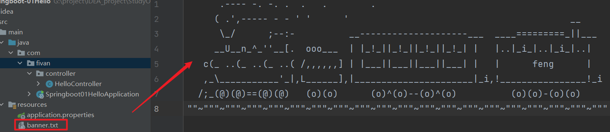
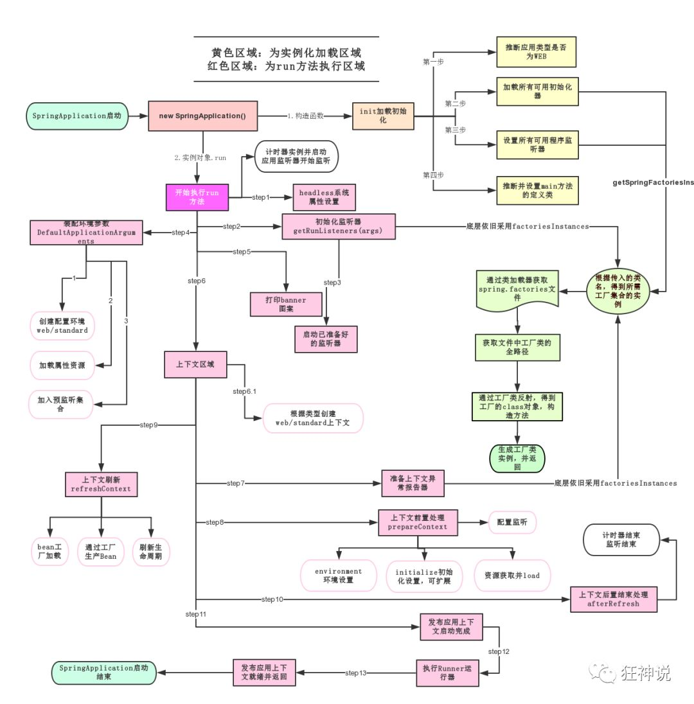

# 一、什么是SpringBoot

就是一个javaweb的开发框架，和SpringMVC类似，对比其他javaweb框架的好处，
官方说是简化开发，约定大于配置，  you can "just run"，能迅速的开发web应用。

Spring Boot 基于 Spring 开发，Spirng Boot 本身并不提供 Spring 框架的核心特性以及扩展功能，
只是用于快速、敏捷地开发新一代基于 Spring 框架的应用程序。

**约定大于配置的核心思想**

**Spring Boot的主要优点：**

- 为所有Spring开发者更快的入门
- **开箱即用**，提供各种默认配置来简化项目配置
- 内嵌式容器简化Web项目
- 没有冗余代码生成和XML配置的要求

# 二、什么是微服务

微服务是一种架构风格，它要求我们在开发一个应用的时候，这个应用必须构建成一系列小服务的组合；
可以通过http的方式进行互通。要说微服务架构，先得说说过去我们的单体应用架构。

## 单体应用架构

所谓单体应用架构(all in one)是指，我们将一个应用的中的所有应用服务都封装在一个应用中。

这样做的好处是：易于开发和测试；方便部署；
缺点是：哪怕我要修改一个非常小的地方，我都需要停掉整个服务，重新打包、部署这个应用war包。

## 微服务架构

所谓微服务架构，就是打破之前all in one的架构方式，把每个功能元素独立出来。把独立出来的
功能元索动态组合，需要的功能元索才去拿来组合，需要多一些时 可以整合多个功能元索。
所以微服务架构是对功能元索进行复制，而没有对整个应用进行复制。

这样做的好处是:
1.节省了调用资源。
2.每个功能元素的服务都是一个可替换的、可独立升级的软件代码。

# 三、第一个SpringBoot程序

1、直接在官网上配置后打包下载

网址：https://start.spring.io/

2、在IDEA中创建Spring Initializr；配置好信息即可


3、创建好后直接运行application即可访问


4、可在application.properties文件中修改端口号

```properties
# 修改端口号
server.port=8081
```

5、打成jar包


将其jar包放到任意目录下；通过命令行java -jar xxxx即可运行项目

## 修改banner

1、在resource下创建banner.txt

2、将要使用的banner放到里面即可



# 四、SpringBoot自动装配

## 自动配置

**pom.xml**

spring-boot-dependencies：主要核心依赖在父工程中

**启动器**

```xml
<dependency>
    <groupId>org.springframework.boot</groupId>
    <artifactId>spring-boot-starter-web</artifactId>
</dependency>
```

启动器：即SpringBoot的启动场景。

springboot会将所有的功能场景，都变成一个个的启动器。

我们要使用什么功能，就只需要找到对应的启动器就可以了`starter`

**主程序**

```java
//@SpringBootApplication：标注这是一个springboot的应用
@SpringBootApplication
public class Springboot01HelloApplication {

  public static void main(String[] args) {
    //启动springboot应用
    SpringApplication.run(Springboot01HelloApplication.class, args);
  }

}
```

**注解**：@SpringBootApplication下

```java
@SpringBootConfiguration：Springboot的配置
  @Configuration：spring配置类
  @Component：spring组件
  
  
@EnableAutoConfiguration：自动配置
  @AutoConfigurationPackage：自动配置包
  	@Import(AutoConfigurationPackages.Registrar.class)：自动配置`包注册`
  @Import(AutoConfigurationImportSelector.class)：自动配置导入选择
  
// 获得候选的配置
protected List<String> getCandidateConfigurations(AnnotationMetadata metadata, AnnotationAttributes attributes) {
    //这里的getSpringFactoriesLoaderFactoryClass（）方法
    //返回的就是我们最开始看的启动自动导入配置文件的注解类；EnableAutoConfiguration
    List<String> configurations = SpringFactoriesLoader.loadFactoryNames(this.getSpringFactoriesLoaderFactoryClass(), this.getBeanClassLoader());
    Assert.notEmpty(configurations, "No auto configuration classes found in META-INF/spring.factories. If you are using a custom packaging, make sure that file is correct.");
    return configurations;
}  
```

## spring.factories: 这就是自动配置根源所在！

**结论：**

1. SpringBoot在启动的时候从类路径下的META-INF/spring.factories中获取EnableAutoConfiguration指定的值
2. 将这些值作为自动配置类导入容器 ， 自动配置类就生效 ， 帮我们进行自动配置工作；
3. 整个J2EE的整体解决方案和自动配置都在springboot-autoconfigure的jar包中；
4. 它会给容器中导入非常多的自动配置类 （xxxAutoConfiguration）, 就是给容器中导入这个场景需要的所有组件,  并配置好这些组件 ；
5. 有了自动配置类 ， 免去了我们手动编写配置注入功能组件等的工作；

**run()方法**

1、推断应用的类型是普通的项目还是Web项目

2、查找并加载所有可用初始化器 ， 设置到initializers属性中

3、找出所有的应用程序监听器，设置到listeners属性中

4、推断并设置main方法的定义类，找到运行的主类



# 五、yaml语法

YAML是 "YAML Ain't a Markup Language" （YAML不是一种标记语言）的递归缩写。在开发的这种语言时，YAML 的意思其实是："Yet Another Markup Language"（仍是一种标记语言)。

**这种语言以数据作为中心，而不是以标记语言为重点！**

传统xml配置：

```xml
<server>
  <port>8081<port>
</server>
```

yaml配置：

```yaml
server:
	prot: 8080
```

> yaml基础语法：对空格要求极高

```yaml
#对象、Map格式
k: 
  v1:
  v2:
```

```yaml
# 对象
student:
    name: feng
    age: 3
或 student: {name: feng,age: 3}
```

```yaml
# 数组
pets:
 - cat
 - dog
 - pig
或 pets: [cat,dog,pig]
```

# 六、属性赋值

yaml文件更强大的地方在于，可以给实体类直接注入匹配值！

1、创建Dog和Person类

2、创建application.yaml，并创建person对象、赋值

```yaml
server:
  port: 8081

person:
  name: feng
  age: 21
  happy: true
  birth: 2020/11/21
  maps: {k1: v1,k2: v2}
  lists: [123,123,123]
  dog:
    name: xiaohua
    age: 3
```

3、在Person类通过@ConfigurationProperties(prefix = "person")注解来绑定配置文件

```java
@ConfigurationProperties(prefix = "person")
@Component
public class Person {
    private String name;
    private Integer age;
    private Boolean happy;
    private Date birth;
    private Map<String,Object> maps;
    private List<Object> lists;
    private Dog dog;
  ········
}
```

注：期间可能需要加个SpringBoot依赖，点击提示即可添加。

4、配置文件占位符

```yaml
person:
    name: qinjiang${random.uuid} # 随机uuid
    age: ${random.int}  # 随机int
    happy: false
    birth: 2000/01/01
    maps: {k1: v1,k2: v2}
    lists:
      - code
      - girl
      - music
    dog:
      name: ${person.hello:other}_旺财 #有被赋值时，则用赋值的xxx_旺财；未被赋值时则用other_旺财
      age: 1
```

# 七、JSR303

**松散绑定**

```java
//实体类
@ConfigurationProperties(prefix = "testdemo")
@Component
public class TestDemo {
    private String userName;
    private int countNum;
}
```

```yaml
//application.yaml
testdemo:
  user-name: test--d2
  count-num: 12
```

**JSR303数据校验**

```java
@Validated //数据校验
public class Person {
    @NotNull
    private String name;
    private Integer age;
    private Boolean happy;
    private Date birth;
    private Map<String,Object> maps;
    private List<Object> lists;
    private Dog dog;
}
```

# 八、多坏境配置

**properties：**


多环境切换：spring.profiles.active=xxx

**yaml：**用三杠隔开；

```yaml
server:
  port: 8081
#激活配置文件
spring:
  profiles:
    active: test
---
server:
  port: 8082
#设置名字
spring:
  profiles: dev
---
server:
  port: 8083
spring:
  profiles: test
```

# 九、自动配置原理


1、SpringBoot启动会加载大量的自动配置类

2、我们看需要的功能有没有在SpringBoot默认写好的自动配置类当中；

3、我们再来看这个自动配置类中到底配置了哪些组件；（只要我们要用的组件存在在其中，我们就不需要再手动配置了）

4、给容器中自动配置类添加组件的时候，会从properties类中获取某些属性。我们只需要在配置文件中指定这些属性的值即可；

**xxxxAutoConfigurartion：自动配置类；**给容器中添加组件

**xxxxProperties:封装配置文件中相关属性；**

# 十、静态资源导入

```java
@Override
public void addResourceHandlers(ResourceHandlerRegistry registry) {
  if (!this.resourceProperties.isAddMappings()) {
    // 已禁用默认资源处理
    logger.debug("Default resource handling disabled");
    return;
  }
  // 缓存控制
  Duration cachePeriod = this.resourceProperties.getCache().getPeriod();
  CacheControl cacheControl = this.resourceProperties.getCache().getCachecontrol().toHttpCacheControl();
  // webjars 配置
  if (!registry.hasMappingForPattern("/webjars/**")) {
    customizeResourceHandlerRegistration(registry.addResourceHandler("/webjars/**")
                                         .addResourceLocations("classpath:/META-INF/resources/webjars/")
                                         .setCachePeriod(getSeconds(cachePeriod)).setCacheControl(cacheControl));
  }
  // 静态资源配置
  String staticPathPattern = this.mvcProperties.getStaticPathPattern();
  if (!registry.hasMappingForPattern(staticPathPattern)) {
    customizeResourceHandlerRegistration(registry.addResourceHandler(staticPathPattern)
                                         .addResourceLocations(getResourceLocations(this.resourceProperties.getStaticLocations()))
                                         .setCachePeriod(getSeconds(cachePeriod)).setCacheControl(cacheControl));
  }
}
```

# 十一、首页定制

在public、static目录下加页面即可

# 十二、thymeleaf模板引擎

使用时 先导入依赖

```xml
<!--thymeleaf-->
<dependency>
  <groupId>org.thymeleaf</groupId>
  <artifactId>thymeleaf-spring5</artifactId>
  <version>3.0.15.RELEASE</version>
</dependency>
<dependency>
  <groupId>org.thymeleaf.extras</groupId>
  <artifactId>thymeleaf-extras-java8time</artifactId>
  <version>3.0.4.RELEASE</version>
</dependency>
```

在html加入：

```html
<html lang="en" xmlns:th="http://www.thymeleaf.org" xmlns:score="http://thymeleafexamples">
```

# 十三、thymeleaf语法

th:text 

th:utext //会转义

th:each

# 十四、MVC配置原理

1.首页配置

将页面的静态资源交给thymeleaf接管；

url：使用@{}

2.页面国际化

1) 先要配置i18n文件；
2) 在项目中用按钮自动切换，则需自定义组件LocaleResolver
3) 将自己的组件配置到spring容器中@Bean
4) 用"#{}"

3.登录+拦截器

4.员工列表展示

​	1.提取公共部分

​	th:fragment="sidebar" //打包

​	th:replace"~{commons/xxx::sidebar}" //插入/替换

​	传参直接使用()传参

​	2.列表展示

5.添加员工

​	1.按钮提交；2.页面跳转；3.业务执行；4.返回主页

6.CRUD

7.404页面：在templates目录下创建error并新建404页面即可。

# 十五、整合JDBC

1.导入启动类

```xml
<dependency>
    <groupId>org.springframework.boot</groupId>
    <artifactId>spring-boot-starter-jdbc</artifactId>
</dependency>
<dependency>
    <groupId>mysql</groupId>
    <artifactId>mysql-connector-java</artifactId>
    <scope>runtime</scope>
</dependency>
```

2.编写配置文件

```yaml
spring:
  datasource:
    username: root
    password: 123456
    #?serverTimezone=UTC解决时区的报错
    url: jdbc:mysql://localhost:3306/springboot?serverTimezone=UTC&useUnicode=true&characterEncoding=utf-8
    driver-class-name: com.mysql.cj.jdbc.Driver
```

3.编写controller类；利用JDCBtemplate进行调用执行

```java
@RestController
public class DemoController {

    @Autowired
    JdbcTemplate jdbcTemplate;

    @GetMapping("/selectList")
    public List<Map<String,Object>> selectAll(){
        String sql="select * from user";
        List<Map<String, Object>> mapList = jdbcTemplate.queryForList(sql);
        return mapList;
    }
}
```

# 十六、整合Druid数据源

1.导入包

```xml
<dependency>
  <groupId>com.alibaba</groupId>
  <artifactId>druid</artifactId>
  <version>1.2.8</version>
</dependency>
<dependency>
  <groupId>log4j</groupId>
  <artifactId>log4j</artifactId>
  <version>1.2.17</version>
</dependency>
```

2.编写配置文件

```yaml
spring:
  datasource:
    # 时区：serverTimezone=UTC
    url: jdbc:mysql://localhost:3306/mybatis?serverTimezone=UTC&useUnicode=true&aharacterEncoding=utf-8
    driver-class-name: com.mysql.cj.jdbc.Driver
    username: root
    password: 107610
    type: com.alibaba.druid.pool.DruidDataSource
    #Spring Boot 默认是不注入这些属性值的，需要自己绑定
    #druid 数据源专有配置
    initialSize: 5
    minIdle: 5
    maxActive: 20
    maxWait: 60000
    timeBetweenEvictionRunsMillis: 60000
    minEvictableIdleTimeMillis: 300000
    validationQuery: SELECT 1 FROM DUAL
    testWhileIdle: true
    testOnBorrow: false
    testOnReturn: false
    poolPreparedStatements: true
    #配置监控统计拦截的filters，stat:监控统计、log4j：日志记录、wall：防御sql注入
    #如果允许时报错  java.lang.ClassNotFoundException: org.apache.log4j.Priority
    #则导入 log4j 依赖即可，Maven 地址：https://mvnrepository.com/artifact/log4j/log4j
    filters: stat,wall,log4j
    maxPoolPreparedStatementPerConnectionSize: 20
    useGlobalDataSourceStat: true
    connectionProperties: druid.stat.mergeSql=true;druid.stat.slowSqlMillis=500
```

3.写配置类

```java
@Configuration
public class DruidConfig {
  @ConfigurationProperties(prefix = "spring.datasource")
  @Bean
  public DataSource druidDataSource(){
    return new DruidDataSource();
  }
  //后台监控
  @Bean
  public ServletRegistrationBean statViewServlet(){
    ServletRegistrationBean<StatViewServlet> bean = new ServletRegistrationBean<>(new StatViewServlet(),"/druid/*");
    //配置后台登录的账号 密码
    Map<String, String> initParameters = new HashMap<>();
    //增加配置
    initParameters.put("loginUsername","admin123");
    initParameters.put("loginPassword","123456f");
    bean.setInitParameters(initParameters);
    return bean;
  }
  //filter
  @Bean
  public FilterRegistrationBean webStatFilter(){
    FilterRegistrationBean bean = new FilterRegistrationBean();
    bean.setFilter(new WebStatFilter());
    Map<String, String> initParameters = new HashMap<>();
    initParameters.put("exclusions","*.js,*.css,/druid/*");
    bean.setInitParameters(initParameters);
    return bean;
  }
}
```

4.访问http://localhost:8080/druid/login.html


# 十七、整合MyBatis框架

整合包：mybatis-spring-starter

1.导入包

2.编写配置文件及mybatis

```yaml
spring:
  datasource:
    url: jdbc:mysql://localhost:3306/mybatis?useUncode=true&serverTimezone=UTC&characterEncode=utf-8
    username: root
    password: 107610
    driver-class-name: com.mysql.cj.jdbc.Driver

# 整合mybatis
mybatis:
  type-aliases-package: com.fivan.pojo
  mapper-locations: classpath:mybatis/*.xml
```

3.编写sql；4.service调用mapper；5.controller调service

# SpringSecurity

主要做安全

1.导入包

```xml
<dependency>
   <groupId>org.springframework.boot</groupId>
   <artifactId>spring-boot-starter-security</artifactId>
</dependency>
```

2.配置类

```java
@EnableWebSecurity // 开启WebSecurity模式
public class SecurityConfig extends WebSecurityConfigurerAdapter {
   @Override
   protected void configure(HttpSecurity http) throws Exception {
       
  }
}
```

```java
@Override
protected void configure(HttpSecurity http) throws Exception {
  // 定制请求的授权规则
  // 首页所有人可以访问
  http.authorizeRequests().antMatchers("/").permitAll()
    .antMatchers("/level1/**").hasRole("vip1")
    .antMatchers("/level2/**").hasRole("vip2")
    .antMatchers("/level3/**").hasRole("vip3");

  //访问不了则会跳转到登录页
  http.formLogin()
    .usernameParameter("username")
    .passwordParameter("password")
    .loginPage("/toLogin")
    .loginProcessingUrl("/login");

  //注销
  http.logout().logoutSuccessUrl("/");
  http.csrf().disable();//关闭csrf功能:跨站请求伪造,默认只能通过post方式提交logout请求

  //记住我
  http.rememberMe().rememberMeParameter("remember");
}
```

```java
//定义认证规则
@Override
protected void configure(AuthenticationManagerBuilder auth) throws Exception {
  auth.inMemoryAuthentication().passwordEncoder(new BCryptPasswordEncoder())
    .withUser("fivan").password(new BCryptPasswordEncoder()
                                .encode("123456")).roles("vip1","vip2")
    .and()
    .withUser("root").password(new BCryptPasswordEncoder()
                               .encode("123456")).roles("vip1","vip2","vip3");
}
```

# 十八、shiro

1.导入依赖

2.配置文件

3.HelloShiro

# 十九、shiro的subject

```java
Subject currentUser = SecurityUtils.getSubject();
Session session = currentUser.getSession();
currentUser.isAuthenticated();
currentUser.getPrincipal();
currentUser.hasRole("schwartz");
currentUser.isPermitted("lightsaber:wield");
currentUser.logout();
```

# 二十、SpringBoot整合Shiro

1.导包

```xml
<!-- https://mvnrepository.com/artifact/org.apache.shiro/shiro-spring -->
<dependency>
    <groupId>org.apache.shiro</groupId>
    <artifactId>shiro-spring</artifactId>
    <version>1.7.1</version>
</dependency>
```

2.注册Realm

```java
public class UserRealm extends AuthorizingRealm {
  //授权
  @Override
  protected AuthorizationInfo doGetAuthorizationInfo(PrincipalCollection principalCollection) {
    System.out.println("doGetAuthorizationInfo");
    return null;
  }
  //认证
  @Override
  protected AuthenticationInfo doGetAuthenticationInfo(AuthenticationToken authenticationToken) throws AuthenticationException {
    System.out.println("doGetAuthenticationInfo");
    return null;
  }
}
```

3.编写配置文件

```java
@Configuration
public class ShiroConfig {
  //ShiroFilterFactoryBean
  @Bean
  public ShiroFilterFactoryBean getShiroFilterFactoryBean(@Qualifier("securityManager")DefaultWebSecurityManager defaultWebSecurityManager){
    ShiroFilterFactoryBean bean = new ShiroFilterFactoryBean();
    bean.setSecurityManager(defaultWebSecurityManager);
    return bean;
  }
  //DefaultWebSecurity
  @Bean(name = "securityManager")
  public DefaultWebSecurityManager getDefaultWebSecurityManager(@Qualifier("userRealm") UserRealm userRealm){
    DefaultWebSecurityManager securityManager = new DefaultWebSecurityManager();
    securityManager.setRealm(userRealm);
    return securityManager;
  }
  //创建realm对象
  @Bean
  public UserRealm userRealm(){
    return new UserRealm();
  }
}
```

# 二十一、shiro登录拦截

```yaml
添加过滤器设置
anon:无需认证
authc:必须认证
user:必须拥有记住我功能才可以用
perms:拥有某个资源权限才可以
role:拥有某个角色权限才可以
```

```java
@Bean
public ShiroFilterFactoryBean getShiroFilterFactoryBean(@Qualifier("securityManager")DefaultWebSecurityManager defaultWebSecurityManager){
  ShiroFilterFactoryBean bean = new ShiroFilterFactoryBean();
  bean.setSecurityManager(defaultWebSecurityManager);
  LinkedHashMap<String, String> filterMap = new LinkedHashMap<>();
  filterMap.put("/user/*","authc");
  bean.setFilterChainDefinitionMap(filterMap);
  bean.setLoginUrl("/user/toLogin");
  return bean;
}
```

# 二十二、shiro用户认证

```java
@RequestMapping("/loginInfo")
public String login(String username, String password, Model model){
  //获取当前用户
  Subject subject = SecurityUtils.getSubject();
  //封装用户登录的数据
  UsernamePasswordToken token = new UsernamePasswordToken(username,password);
  try {
    subject.login(token);//执行登录方法
    return "index";
  } catch (UnknownAccountException e) {//用户名不存在
    model.addAttribute("msg","用户名错误");
    return "login";
  }catch (IncorrectCredentialsException e){//密码不存在
    model.addAttribute("msg","密码错误");
    return "login";
  }
}
```

```java
@Override
protected AuthenticationInfo doGetAuthenticationInfo(AuthenticationToken token) throws AuthenticationException {
	//给定用户名 密码
  String name = "root";
  String password = "123456";
  UsernamePasswordToken userToken = (UsernamePasswordToken) token;
  if (!(userToken.getUsername().equals(name))){//抛出用户名不存在
    return null;
  }
  return new SimpleAuthenticationInfo("",password,"");
}
```

# 二十三、shiro请求授权

# 二十四、shiro整合Thymeleaf

# 二十五、Swagger

世界上最流行的Apiece框架

RestFul Api文档在线自动生成工具 Api文档与API定义同步更新

# 二十六、配置Swagger

1.依赖

```xml
<!-- https://mvnrepository.com/artifact/io.springfox/springfox-swagger2 -->
<dependency>
    <groupId>io.springfox</groupId>
    <artifactId>springfox-swagger2</artifactId>
    <version>2.9.2</version>
</dependency>
<!-- https://mvnrepository.com/artifact/io.springfox/springfox-swagger-ui -->
<dependency>
    <groupId>io.springfox</groupId>
    <artifactId>springfox-swagger-ui</artifactId>
    <version>2.9.2</version>
</dependency>
```

2.配置Swagger--》Config

```java
@Configuration
@EnableSwagger2
public class SwaggerConfig {
}
```

3.访问路径：http://localhost:8080/swagger-ui.html

4.配置Swagger

```java
@Configuration
@EnableSwagger2
public class SwaggerConfig {
  @Bean
  public Docket docket(){
    return new Docket(DocumentationType.SWAGGER_2)
      .apiInfo(apiInfo());
  }
  public ApiInfo apiInfo(){
    Contact contact = new Contact("feng", "https://www.baidu.com", "207128153@qq.com");
    return new ApiInfo(
      "fivan Swagger log",
      "恭喜您 发现一个宝藏男孩",
      "v1.0",
      "urn:tos",
      contact,
      "Apache 2.0",
      "http://www.apache.org/licenses/LICENSE-2.0",
      new ArrayList());
  }
}
```

# 二十七、配置扫描接口及开关

**扫描**

RequestHandlerSelectors：设置要扫描接口的方式
basePackage:扫描指定包下的请求
any:扫描全部
none:不扫描
withClassAnnotation:扫描类上的注解，参数是注解的反射对象
withMethodAnnotation:扫描方法上的注解

```java
@Bean
public Docket docket(){
  return new Docket(DocumentationType.SWAGGER_2)
    .apiInfo(apiInfo())
    .select()
    .apis(RequestHandlerSelectors.basePackage("com.fivan.controller"))
    .build();
}
```

**开关**   enable(false)

```java
@Bean
public Docket docket(){
  return new Docket(DocumentationType.SWAGGER_2)
    .apiInfo(apiInfo())
    .enable(false)
    .select()
    .apis(RequestHandlerSelectors.basePackage("com.fivan.controller"))
    .paths(PathSelectors.any())
    .build();
}
```

Swagger只在生产环境中使用，发布时不使用

```java
@Bean
public Docket docket(Environment environment){
  //设置要显示Swagger的环境
  Profiles profiles = Profiles.of("dev", "test");
  //判断是否在设定的环境中
  boolean flag = environment.acceptsProfiles(profiles);
  return new Docket(DocumentationType.SWAGGER_2)
    .apiInfo(apiInfo())
    .enable(flag)
    .select()
    .apis(RequestHandlerSelectors.basePackage("com.fivan.controller"))
    .paths(PathSelectors.any())
    .build();
}
```

application.properties

```properties
spring.profiles.active=pro
```

# 二十八、分组和接口

```java
.groupName("fivan")//分组
```

```java
@Bean
public Docket docket1(){
    return new Docket(DocumentationType.SWAGGER_2).groupName("zhangzhang");
}

@Bean
public Docket docket2(){
    return new Docket(DocumentationType.SWAGGER_2).groupName("xiaoxiao");
}
```

```java
@ApiModel("用户类")
public class User {
    @ApiModelProperty("用户名")
    public String name;
    @ApiModelProperty("密码")
    public String password;
}//实体类
```

```java
@ApiOperation("hello的控制类")
@GetMapping("/hello")
public String sayHello(){
    return "1234567890";
} 
@ApiOperation("user的控制类")
@PostMapping("/getUser")
public User getUser(@ApiParam("用户")User user){
    return user;
}//controller
```

# 二十九、异步任务

实现异步任务：1.在方法上加@Async注解；2.在启动类上开启异步@EnableAsync

```java
@Async
public void hello(){
    try {
        Thread.sleep(3000);
    } catch (InterruptedException e) {
        e.printStackTrace();
    }
    System.out.println("数据处理。。。。。");
}
```

```java
@SpringBootApplication
@EnableAsync
public class SpringbootSyanApplication {
    public static void main(String[] args) {
        SpringApplication.run(SpringbootSyanApplication.class, args);
    }
}
```

# 三十、邮件任务

# 三十一、定时任务

# 三十二、SpringBoot集成Redis

# 三十三、自定义RedisTmplate

# 三十四、分布式系统

# 三十五、RPC

# 三十六、Dubbo及zookeeper安装

# 三十七、Dubbo-admin安装测试


