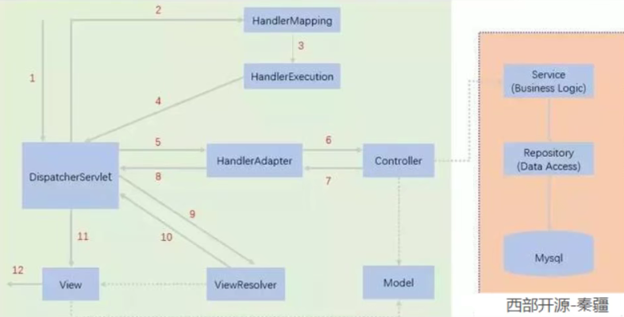

# 一、初始SpringMVC

Spring MVC的特点：

1. 轻量级，简单易学
2. 高效 , 基于请求响应的MVC框架
3. 与Spring兼容性好，无缝结合
4. 约定优于配置
5. 功能强大：RESTful、数据验证、格式化、本地化、主题等
6. 简洁灵活

Spring的web框架围绕**DispatcherServlet** [ 调度Servlet ] 设计。

# 二、SpringMVC执行流程



# 三、注解开发SpringMVC

web.xml

```xml
<!--DispatchServlet-->
<servlet>
    <servlet-name>springmvc</servlet-name>
    <servlet-class>org.springframework.web.servlet.DispatcherServlet</servlet-class>
    <!--绑定spring配置文件-->
    <init-param>
        <param-name>contextConfigLocation</param-name>
        <param-value>classpath:springmvc-servlet.xml</param-value>
    </init-param>
    <!--启动级别-->
    <load-on-startup>1</load-on-startup>
</servlet>
<servlet-mapping>
    <servlet-name>springmvc</servlet-name>
    <url-pattern>/</url-pattern>
</servlet-mapping>
```

springmvc-servlet.xml

```xml
<?xml version="1.0" encoding="UTF-8"?>
<beans xmlns="http://www.springframework.org/schema/beans"
       xmlns:xsi="http://www.w3.org/2001/XMLSchema-instance"
       xmlns:context="http://www.springframework.org/schema/context"
       xmlns:mvc="http://www.springframework.org/schema/mvc"
       xsi:schemaLocation="http://www.springframework.org/schema/beans
        https://www.springframework.org/schema/beans/spring-beans.xsd
        http://www.springframework.org/schema/context
        https://www.springframework.org/schema/context/spring-context.xsd
        http://www.springframework.org/schema/mvc
        https://www.springframework.org/schema/mvc/spring-mvc.xsd">
    <!--开启包扫描-->
    <context:component-scan base-package="com.fivan.controller"/>
    <mvc:default-servlet-handler />
    <mvc:annotation-driven />
    <bean class="org.springframework.web.servlet.view.InternalResourceViewResolver" 			id="internalResourceViewResolver">
        <property name="prefix" value="/WEB-INF/jsp/"/>
        <property name="suffix" value=".jsp"/>
    </bean>
</beans>
```

```java
@Controller
public class HelloController {
    @RequestMapping("/hello")
    public String hello(Model model){
        model.addAttribute("msg","Hello,SpringMVC!!!");
        return "myHello";
    }
}
```

访问：http://localhost:8080/smv3/hello

# 四、Controller配置

@Controller注解类型用于声明Spring类的实例是一个控制器（在讲IOC时还提到了另外3个注解）；

Spring可以使用扫描机制来找到应用程序中所有基于注解的控制器类，为了保证Spring能找到你的控制器，需要在配置文件中声明组件扫描。

@Controller ：
代表这个类会被Spring接管，类中的所有方法，如果返回值是String，并且有具体页面可以跳转，就会被视图解析器解析

```java
@Controller
public class MyController {
    @RequestMapping("/hlo")
    public String getHello(Model mv){
        mv.addAttribute("msg","Hello,SpringMVC.");
        return "myHello";
    }
}
```

# 五、RequestMapping

@RequestMapping
注解用于映射url到控制器类或一个特定的处理程序方法。可用于类或方法上。用于类上，表示类中的所有响应请求的方法都是以该地址作为父路径。

# 六、RestFul

```java
@Controller
public class RestFulController {
    @RequestMapping (value = "/hello/{a}/{b}",method = RequestMethod.DELETE)
    public String test1(@PathVariable int a,@PathVariable int b, Model mv){
        mv.addAttribute("msg","结果"+(a+b));
        return "myHello";
    }
    @GetMapping("/hell/{a}/{b}")
    public String test2(@PathVariable int a,@PathVariable int b, Model mv){
        mv.addAttribute("msg","结果2:"+(a+b));
        return "myHello";
    }
}
//@RequestMapping类似父级，GetMapping类似父级的细分
```

请求地址：http://localhost:8080/smv4/hell/55/45

# 七、重定向和转发

forward：请求转发；

redirect：重定向

# 八、JSON

JSON(JavaScript Object Notation, JS 对象标记) 是一种轻量级的数据交换格式，目前使用特别广泛。

采用完全独立于编程语言的**文本格式**来存储和表示数据。

简洁和清晰的层次结构使得 JSON 成为理想的数据交换语言。

易于人阅读和编写，同时也易于机器解析和生成，并有效地提升网络传输效率。

**JSON 和 JavaScript 对象互转**

要实现从JSON字符串转换为JavaScript 对象，使用 JSON.parse() 方法：

```javascript
var obj = JSON.parse('{"a": "Hello", "b": "World"}');
//结果是 {a: 'Hello', b: 'World'}
```

要实现从JavaScript 对象转换为JSON字符串，使用 JSON.stringify() 方法：

```javascript
var json = JSON.stringify({a: 'Hello', b: 'World'});
//结果是 '{"a": "Hello", "b": "World"}'
```

# 九、Jackson

maven

```xml
<dependency>
    <groupId>com.fasterxml.jackson.core</groupId>
    <artifactId>jackson-databind</artifactId>
    <version>2.13.0</version>
</dependency>
```

SpringMVC解决json乱码

```xml
<!--json乱码解决-->
<mvc:annotation-driven>
    <mvc:message-converters register-defaults="true">
        <bean class="org.springframework.http.converter.StringHttpMessageConverter">
            <constructor-arg value="UTF-8"/>
        </bean>
        <bean class="org.springframework.http.converter.json.MappingJackson2HttpMessageConverter">
            <property name="objectMapper">
                <bean class="org.springframework.http.converter.json.Jackson2ObjectMapperFactoryBean">
                    <property name="failOnEmptyBeans" value="false"/>
                </bean>
            </property>
        </bean>
    </mvc:message-converters>
</mvc:annotation-driven>
```

FastJson

```xml
<dependency>
    <groupId>com.alibaba</groupId>
    <artifactId>fastjson</artifactId>
    <version>1.2.75</version>
</dependency>
```

```java
System.out.println("*******Java对象 转 JSON字符串*******");
String str1 = JSON.toJSONString(list);
System.out.println("JSON.toJSONString(list)==>"+str1);
String str2 = JSON.toJSONString(user1);
System.out.println("JSON.toJSONString(user1)==>"+str2);
System.out.println("****** JSON字符串 转 Java对象*******");
User jp_user1=JSON.parseObject(str2,User.class);
System.out.println("JSON.parseObject(str2,User.class)==>"+jp_user1);
System.out.println("****** Java对象 转 JSON对象 ******");
JSONObject jsonObject1 = (JSONObject) JSON.toJSON(user2);
System.out.println("(JSONObject) JSON.toJSON(user2)==>"+jsonObject1.getString("name"));
System.out.println("****** JSON对象 转 Java对象 ******");
User to_java_user = JSON.toJavaObject(jsonObject1, User.class);
System.out.println("JSON.toJavaObject(jsonObject1, User.class)==>"+to_java_user);
```

# 十、SSM整合

pom.xml依赖

```xml
<!--依赖-->
<dependencies>
    <!--Junit-->
    <dependency>
        <groupId>junit</groupId>
        <artifactId>junit</artifactId>
        <version>4.12</version>
    </dependency>
    <!--数据库-->
    <dependency>
        <groupId>mysql</groupId>
        <artifactId>mysql-connector-java</artifactId>
        <version>5.1.47</version>
    </dependency>
    <!--数据库连接池-->
    <dependency>
        <groupId>com.mchange</groupId>
        <artifactId>c3p0</artifactId>
        <version>0.9.5.2</version>
    </dependency>
    <!--Servlet-api-->
    <dependency>
        <groupId>javax.servlet</groupId>
        <artifactId>servlet-api</artifactId>
        <version>2.5</version>
    </dependency>
    <!--jsp-->
    <dependency>
        <groupId>javax.servlet.jsp</groupId>
        <artifactId>jsp-api</artifactId>
        <version>2.2</version>
    </dependency>
    <!--jstl-->
    <dependency>
        <groupId>javax.servlet</groupId>
        <artifactId>jstl</artifactId>
        <version>1.2</version>
    </dependency>
    <!--mybatis-->
    <dependency>
        <groupId>org.mybatis</groupId>
        <artifactId>mybatis</artifactId>
        <version>3.5.6</version>
    </dependency>
    <!--mybatis-spring-->
    <dependency>
        <groupId>org.mybatis</groupId>
        <artifactId>mybatis-spring</artifactId>
        <version>2.0.6</version>
    </dependency>
    <!--springmvc-->
    <dependency>
        <groupId>org.springframework</groupId>
        <artifactId>spring-webmvc</artifactId>
        <version>5.2.9.RELEASE</version>
    </dependency>
    <!--spring-jdbc-->
    <dependency>
        <groupId>org.springframework</groupId>
        <artifactId>spring-jdbc</artifactId>
        <version>5.2.9.RELEASE</version>
    </dependency>
    <!--lombok-->
    <dependency>
        <groupId>org.projectlombok</groupId>
        <artifactId>lombok</artifactId>
        <version>1.18.20</version>
    </dependency>
</dependencies>
<!--静态资源导出问题-->
<build>
    <resources>
        <resource>
            <directory>src/main/resources</directory>
            <includes>
                <include>**/*.properties</include>
                <include>**/*.xml</include>
            </includes>
            <filtering>false</filtering>
        </resource>
        <resource>
            <directory>src/main/java</directory>
            <includes>
                <include>**/*.properties</include>
                <include>**/*.xml</include>
            </includes>
            <filtering>false</filtering>
        </resource>
    </resources>
</build>
```

## MyBatis层

database.properties

```properties
jdbc.driver=com.mysql.jdbc.Driver
jdbc.url=jdbc:mysql://localhost:3306/ssmbuild?useSSL=true&useUnicode=true&characterEncoding=utf8
jdbc.username=root
jdbc.password=107610
```

mybatis-config.xml

```xml
<?xml version="1.0" encoding="UTF-8" ?>
<!DOCTYPE configuration
        PUBLIC "-//mybatis.org//DTD Config 3.0//EN"
        "http://mybatis.org/dtd/mybatis-3-config.dtd">
<configuration>
    <typeAliases>
        <package name="com.fivan.pojo"/>
    </typeAliases>
    <mappers>
        <mapper class="com.fivan.mapper.BooksMapper"/>
    </mappers>
</configuration>
```

## Spring层

spring-mapper.xml

```xml
<?xml version="1.0" encoding="UTF-8"?>
<beans xmlns="http://www.springframework.org/schema/beans"
       xmlns:xsi="http://www.w3.org/2001/XMLSchema-instance"
       xmlns:context="http://www.springframework.org/schema/context"
       xsi:schemaLocation="http://www.springframework.org/schema/beans
                           http://www.springframework.org/schema/beans/spring-beans.xsd
                           http://www.springframework.org/schema/context
                           http://www.springframework.org/schema/context/spring-context.xsd">
    <!--关联数据库配置信息-->
    <context:property-placeholder location="classpath:database.properties"/>
    <!--数据源-->
    <bean id="dataSource" class="com.mchange.v2.c3p0.ComboPooledDataSource">
        <property name="driverClass" value="${jdbc.driver}"/>
        <property name="jdbcUrl" value="${jdbc.url}"/>
        <property name="user" value="${jdbc.username}"/>
        <property name="password" value="${jdbc.password}"/>
    </bean>
    <!--sqlSessionFactory-->
    <bean class="org.mybatis.spring.SqlSessionFactoryBean" id="sqlSessionFactory">
        <property name="dataSource" ref="dataSource"/>
        <property name="configLocation" value="classpath:mybatis-config.xml"/>
    </bean>
    <!--配置Dao接口扫描包，动态注入Dao接口-->
    <bean class="org.mybatis.spring.mapper.MapperScannerConfigurer">
        <property name="sqlSessionFactoryBeanName" value="sqlSessionFactory"/>
        <property name="basePackage" value="com.fivan.mapper"/>
    </bean>
</beans>
```

spring-service.xml

```xml
<?xml version="1.0" encoding="UTF-8"?>
<beans xmlns="http://www.springframework.org/schema/beans"
       xmlns:xsi="http://www.w3.org/2001/XMLSchema-instance"
       xmlns:context="http://www.springframework.org/schema/context"
       xsi:schemaLocation="http://www.springframework.org/schema/beans
       http://www.springframework.org/schema/beans/spring-beans.xsd
       http://www.springframework.org/schema/context
       http://www.springframework.org/schema/context/spring-context.xsd">
    <!--扫描service包-->
    <context:component-scan base-package="com.fivan.service"/>
    <!--注入业务类-->
    <bean class="com.fivan.service.BooksServiceImpl" id="service">
        <property name="booksMapper" ref="booksMapper"/>
    </bean>
    <!--声明式事务-->
    <bean id="transactionManager" class="org.springframework.jdbc.datasource.DataSourceTransactionManager">
        <property name="dataSource" ref="dataSource"/>
    </bean>
</beans>
```

## SpringMVC层

spring-mvc.xml

```xml
<?xml version="1.0" encoding="UTF-8"?>
<beans xmlns="http://www.springframework.org/schema/beans"
       xmlns:xsi="http://www.w3.org/2001/XMLSchema-instance"
       xmlns:context="http://www.springframework.org/schema/context"
       xmlns:mvc="http://www.springframework.org/schema/mvc"
       xsi:schemaLocation="http://www.springframework.org/schema/beans
       http://www.springframework.org/schema/beans/spring-beans.xsd
       http://www.springframework.org/schema/context
       http://www.springframework.org/schema/context/spring-context.xsd
       http://www.springframework.org/schema/mvc
       https://www.springframework.org/schema/mvc/spring-mvc.xsd">

    <!--注解驱动-->
    <mvc:annotation-driven/>
    <!--静态资源过滤-->
    <mvc:default-servlet-handler/>
    <!--开启包扫描-->
    <context:component-scan base-package="com.fivan.controller"/>

    <!--视图解析器-->
    <bean id="internalResourceViewResolver" class="org.springframework.web.servlet.view.InternalResourceViewResolver">
        <property name="prefix" value="/WEB-INF/jsp/"/>
        <property name="suffix" value=".jsp"/>
    </bean>
</beans>
```

applicationContext.xml

```xml
<?xml version="1.0" encoding="UTF-8"?>
<beans xmlns="http://www.springframework.org/schema/beans"
       xmlns:xsi="http://www.w3.org/2001/XMLSchema-instance"
       xmlns:context="http://www.springframework.org/schema/context"
       xsi:schemaLocation="http://www.springframework.org/schema/beans
       http://www.springframework.org/schema/beans/spring-beans.xsd
       http://www.springframework.org/schema/context
       http://www.springframework.org/schema/context/spring-context.xsd">
    <import resource="spring-mapper.xml"/>
    <import resource="spring-service.xml"/>
    <import resource="spring-mvc.xml"/>
</beans>
```

web.xml

```xml
<?xml version="1.0" encoding="UTF-8"?>
<web-app xmlns="http://xmlns.jcp.org/xml/ns/javaee"
         xmlns:xsi="http://www.w3.org/2001/XMLSchema-instance"
         xsi:schemaLocation="http://xmlns.jcp.org/xml/ns/javaee http://xmlns.jcp.org/xml/ns/javaee/web-app_4_0.xsd"
         version="4.0">
    <!--DispatcherServlet-->
    <servlet>
        <servlet-name>DispatcherServlet</servlet-name>
        <servlet-class>org.springframework.web.servlet.DispatcherServlet</servlet-class>
        <init-param>
            <param-name>contextConfigLocation</param-name>
            <param-value>classpath:applicationContext.xml</param-value>
        </init-param>
        <load-on-startup>1</load-on-startup>
    </servlet>
    <servlet-mapping>
        <servlet-name>DispatcherServlet</servlet-name>
        <url-pattern>/</url-pattern>
    </servlet-mapping>
    <!--乱码过滤-->
    <filter>
        <filter-name>encodingFilter</filter-name>
        <filter-class>org.springframework.web.filter.CharacterEncodingFilter</filter-class>
        <init-param>
            <param-name>encoding</param-name>
            <param-value>utf-8</param-value>
        </init-param>
    </filter>
    <filter-mapping>
        <filter-name>encodingFilter</filter-name>
        <url-pattern>/*</url-pattern>
    </filter-mapping>
    <session-config>
        <session-timeout>15</session-timeout>
    </session-config>
</web-app>
```

# 项目实战

# 十一、Ajax

AJAX = Asynchronous JavaScript and XML（异步的 JavaScript 和 XML）。

AJAX 是一种在无需重新加载整个网页的情况下，能够更新部分网页的技术。

Ajax 不是一种新的编程语言，而是一种用于创建更好更快以及交互性更强的Web应用程序的技术。

```javascript
<script src="${pageContext.request.contextPath}/static/js/jquery-3.6.0.js"></script>
<script>
  function aOut() {
    $.post({
      url:"${pageContext.request.contextPath}/aOut",
      data:{'name':$("#userName").val()},
      success:function (data,status){
        console.log(data);
        console.log(status);
      }
    });
  }
</script>
```

# 十二、Ajax验证用户名体验

```javascript
<script>
    function username() {
        $.get({
            url:"${pageContext.request.contextPath}/login",
            data:{'userName':$("#userName").val()},
            success:function (data) {
                if (data.toString() == 'ok'){
                    $("#name").css("color","green");
                }else{
                    $("#name").css("color","red");
                }
                $("#name").html(data);
            }
        })
    }
    function password() {
        $.get({
            url:"${pageContext.request.contextPath}/login",
            data:{'password':$("#password").val()},
            success:function (data) {
                if (data.toString() == 'ok'){
                    $("#pwd").css("color","green");
                }else{
                    $("#pwd").css("color","red");
                }
                $("#pwd").html(data);
            }
        })
    }
</script>
```

# 一、拦截器

**过滤器与拦截器的区别：**拦截器是AOP思想的具体应用。

**过滤器：**

servlet规范中的一部分，任何java web工程都可以使用在

url-pattern中配置了/*之后，可以对所有要访问的资源进行拦截

**拦截器：** 

拦截器是SpringMVC框架自己的，只有使用了SpringMVC框架的工程才能使用

拦截器只会拦截访问的控制器方法， 如果访问的是jsp/html/css/image/js是不会进行拦截的

```java
public class MyInterceptor implements HandlerInterceptor {
    @Override
    public boolean preHandle(HttpServletRequest request, HttpServletResponse response, Object handler) throws Exception {
        System.out.println("嘿嘿，我在处理前执行。。。。。");
        return true;
    }
    @Override
    public void postHandle(HttpServletRequest request, HttpServletResponse response, Object handler, ModelAndView modelAndView) throws Exception {
        System.out.println("嘿嘿，我在处理后执行。。。。。");
    }
    @Override
    public void afterCompletion(HttpServletRequest request, HttpServletResponse response, Object handler, Exception ex) throws Exception {
        System.out.println("嘿嘿，我在清理。。。。。");
    }
}
```

```xml
<!--配置拦截器 applicationContext.xml-->
<mvc:interceptors>
    <mvc:interceptor>
        <mvc:mapping path="/**"/>
        <bean class="com.fivan.config.MyInterceptor"/>
    </mvc:interceptor>
</mvc:interceptors>
```

# 二、登录判断验证

```java
@Controller
@RequestMapping("/user")
public class LoginController {

    @RequestMapping("main")
    public String main() {
        return "main";
    }

    @RequestMapping("goLogin")
    public String goLogin() {
        return "login";
    }

    @RequestMapping("/login")
    public String goMain(HttpSession session, String username, String password, Model model) {
        session.setAttribute("user", username);
        model.addAttribute("msg", username + "登录成功！");
        return "main";
    }

    @RequestMapping("/loginOut")
    public String loginOut(HttpSession session) {
        session.removeAttribute("user");
        System.out.println(session.getAttribute("user"));
        return "login";
    }
}
```

```java
public class LoginInterceptor implements HandlerInterceptor {

    @Override
    public boolean preHandle(HttpServletRequest request, HttpServletResponse response, Object handler) throws Exception {
        HttpSession session = request.getSession();

        if (request.getRequestURI().contains("goLogin")){
            return true;
        }
        if (request.getRequestURI().contains("login")){
            return true;
        }
        if (session.getAttribute("user")!=null){
            return true;
        }
        request.getRequestDispatcher("/WEB-INF/jsp/login.jsp").forward(request,response);
        return false;
    }
}
```

# 三、SpringMVC总结

文件上传：

```java
@Controller
public class FileController {
    //@RequestParam("file") 将name=file控件得到的文件封装成CommonsMultipartFile 对象
    //批量上传CommonsMultipartFile则为数组即可
    @RequestMapping("/upload")
    public String fileUpload(@RequestParam("file") CommonsMultipartFile file , HttpServletRequest request) throws IOException {
        //获取文件名 : file.getOriginalFilename();
        String uploadFileName = file.getOriginalFilename();
        //如果文件名为空，直接回到首页！
        if ("".equals(uploadFileName)){
            return "redirect:/index.jsp";
        }
        System.out.println("上传文件名 : "+uploadFileName);
        //上传路径保存设置
        String path = request.getServletContext().getRealPath("/upload");
        //如果路径不存在，创建一个
        File realPath = new File(path);
        if (!realPath.exists()){
            realPath.mkdir();
        }
        System.out.println("上传文件保存地址："+realPath);
        InputStream is = file.getInputStream(); //文件输入流
        OutputStream os = new FileOutputStream(new File(realPath,uploadFileName)); //文件输出流
        //读取写出
        int len=0;
        byte[] buffer = new byte[1024];
        while ((len=is.read(buffer))!=-1){
            os.write(buffer,0,len);
            os.flush();
        }
        os.close();
        is.close();
        return "redirect:/index.jsp";
    }
    //采用file.Transto 来保存上传的文件
    @RequestMapping("/upload2")
    public String  fileUpload2(@RequestParam("file") CommonsMultipartFile file, HttpServletRequest request) throws IOException {
        //上传路径保存设置
        String path = request.getServletContext().getRealPath("/upload");
        File realPath = new File(path);
        if (!realPath.exists()){
            realPath.mkdir();
        }
        //上传文件地址
        System.out.println("上传文件保存地址："+realPath);
        //通过CommonsMultipartFile的方法直接写文件（注意这个时候）
        file.transferTo(new File(realPath +"/"+ file.getOriginalFilename()));
        return "redirect:/index.jsp";
    }
}
```

文件下载：

```java
@RequestMapping(value="/download")
public String downloads(HttpServletResponse response ,HttpServletRequest request) throws Exception{
   //要下载的图片地址
   String  path = request.getServletContext().getRealPath("/upload");
   String  fileName = "基础语法.jpg";
   //1、设置response 响应头
   response.reset(); //设置页面不缓存,清空buffer
   response.setCharacterEncoding("UTF-8"); //字符编码
   response.setContentType("multipart/form-data"); //二进制传输数据
   //设置响应头
   response.setHeader("Content-Disposition",
           "attachment;fileName="+URLEncoder.encode(fileName, "UTF-8"));
   File file = new File(path,fileName);
   //2、 读取文件--输入流
   InputStream input=new FileInputStream(file);
   //3、 写出文件--输出流
   OutputStream out = response.getOutputStream();
   byte[] buff =new byte[1024];
   int index=0;
   //4、执行 写出操作
   while((index= input.read(buff))!= -1){
       out.write(buff, 0, index);
       out.flush();
  }
   out.close();
   input.close();
   return null;
}
```
